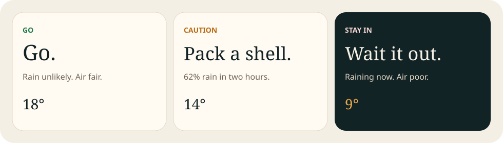
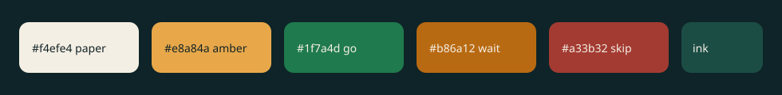

<p align="center">
  
</p>

<p align="center">
  
  
  
  
</p>

<h1 align="center">Leave, or don’t.</h1>

<p align="center">
  <strong>Step Out</strong> is a tiny installable site that answers one question:<br/>
  should you go outside in the next two hours?
</p>

<p align="center">
  
</p>

---

## What it checks

| Signal | Source | What you see |
| --- | --- | --- |
| Rain now + next 2 hours | Open-Meteo 15-minute forecast | Eight slots, peak chance |
| Feels-like temperature & wind | Open-Meteo current | One number, not a dashboard |
| Air | Open-Meteo European AQI | Good → extremely poor |
| Place | Open-Meteo reverse geocoding | Neighbourhood, not raw coordinates |

No API key. The free Open-Meteo tier is **non-commercial**, and the data is [CC BY 4.0](https://open-meteo.com/).

<p align="center">
  
</p>

## The call

- **Go** — rain looks unlikely and the air is fine.
- **Caution** — a real chance of rain, brisk wind, or middling air. Take a shell.
- **Stay in** — it is already wet, or the air is poor enough to skip the outdoor block.

The last reading is stored on the device. If the network drops, you still get the previous call instead of a blank page.

## Run it

Static files only. A service worker will not register from `file://`, so serve the folder:

```bash
python3 -m http.server 8080
```

Open `http://localhost:8080`, allow location, then add it to your home screen.

## Ship it on GitHub Pages

This folder is the site root. `.nojekyll` is included so Pages does not run the files through Jekyll.

1. Push these files to `main`.
2. Settings → Pages → Deploy from branch → `/ (root)`.
3. Open the HTTPS URL. Install and geolocation need that secure origin.

Relative paths work on both `username.github.io` and `username.github.io/repo/`.

## Files

```text
index.html              the whole app
manifest.webmanifest    install name, colours, icons
sw.js                   offline cache of the last page
icons/                  home-screen icons
assets/                 the pictures in this readme
.nojekyll               leave this here
```

<p align="center"><sub>Built to be opened once, decided once, and closed.</sub></p>
